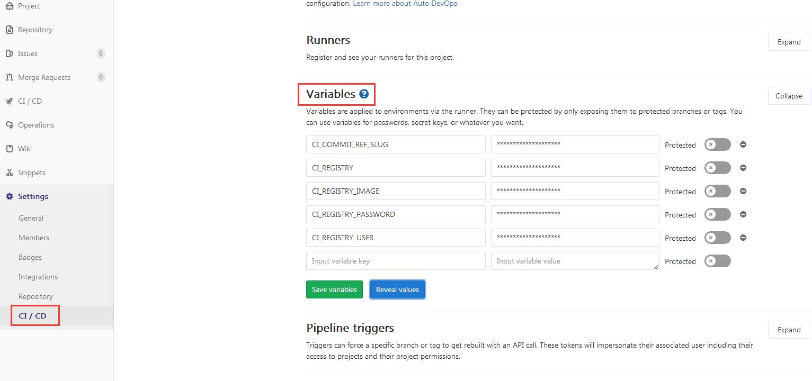
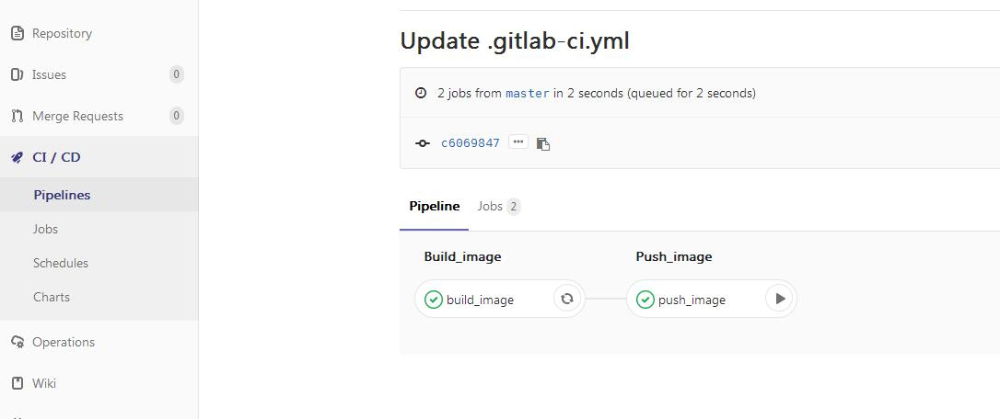
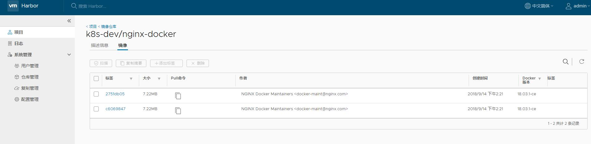

# ngx-docker  
gitlab-ci 测试打包推送镜像  
1、根据具体的系统环境下载对应的二进制执行文件  
```
# Linux x86-64
 wget -O /usr/local/bin/gitlab-runner https://gitlab-runner-downloads.s3.amazonaws.com/latest/binaries/gitlab-runner-linux-amd64
 
# Linux x86
 wget -O /usr/local/bin/gitlab-runner https://gitlab-runner-downloads.s3.amazonaws.com/latest/binaries/gitlab-runner-linux-386
 
# Linux arm
 wget -O /usr/local/bin/gitlab-runner https://gitlab-runner-downloads.s3.amazonaws.com/latest/binaries/gitlab-runner-linux-arm
```
通过下面的地址你可以找到对应版本的二进制文件  

https://docs.gitlab.com/runner/install/bleeding-edge.html#download-any-other-tagged-release

2、给刚下载的二进制执行文件添加执行权限  
 chmod +x /usr/local/bin/gitlab-runner  
3、安装docker
curl -sSL https://get.docker.com/ | sh  
4、创建一个gitlab ci用户  
useradd --comment 'GitLab Runner' --create-home gitlab-runner --shell /bin/bash  
5、将gitlab ci用户添加到docker运行用户的组里面  
usermod -aG root gitlab-runner  
echo "gitlab-runner ALL=(ALL) NOPASSWD: ALL">>/etc/sudoers  

gitlab-runner注册                    
```
[root@k8s-node01 ~]# gitlab-runner register
Running in system-mode.                                                                              
Please enter the gitlab-ci coordinator URL (e.g. https://gitlab.com/):
http://192.168.101.xxx
Please enter the gitlab-ci token for this runner:
xxxxxxxxxxx
Please enter the gitlab-ci description for this runner:
[k8s-node01]: 
Please enter the gitlab-ci tags for this runner (comma separated):
k8s-images
Whether to run untagged builds [true/false]:
[false]: 
Whether to lock Runner to current project [true/false]:
[false]: 
Registering runner... succeeded                     runner=uf3RXX2D
Please enter the executor: shell, kubernetes, docker, docker-ssh, parallels, ssh, virtualbox, docker+machine, docker-ssh+machine:
shell
Runner registered successfully. Feel free to start it, but if it's running already the config should be automatically reloaded! 
```
6.gitlab-ci  
环境变量配置：
 
gitlab-ci pipeline  
  
已经封装好镜像，并把镜像推送到了harbor仓库，稍后可配合helm发布版本  

